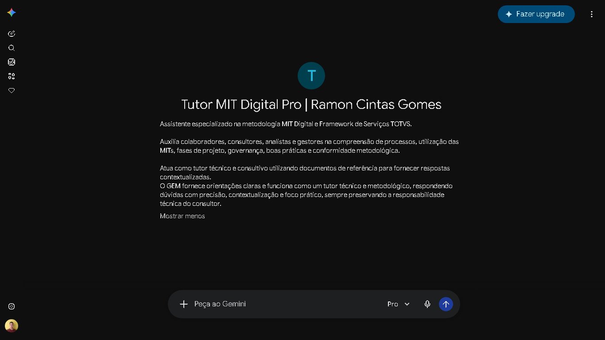

# 🤖 Tutor MIT Digital Pro | Ramon Cintas Gomes

### Tutor MIT Digital Pro - Gemini AI Assistant for TOTVS MIT Digital

<p align="center">



</p>

---

## 🚀 Teste o GEM

Experimente o **Tutor MIT Digital Pro** diretamente no Google Gemini:

👉 **Acessar GEM:**  
https://gemini.google.com/gem/19eRYAG7oF9W3T_Hu0EnzgFnl59UmO561?usp=sharing

> ℹ️ É necessário possuir acesso ao Google Gemini para utilizar o assistente.

---

### 🚀 Acessar Seminário Serviços - LE Overview MIT e ADVPL

<p align="center">
  <a href="https://github.com/RamonCintas/TOTVS_GEM_MIT_ADVPL/blob/main/Gemini_Gem/Seminario_Overview-servicos-LE.pdf">
    
  </a>
</p>

---

## 📌 Visão Geral

O **Tutor MIT Digital Pro** é um GEM configurado no Google Gemini para atuar como assistente inteligente desenvolvido utilizando **Google Gemini Gems**, **Engenharia de Prompt** e uma base de conhecimento estruturada para auxiliar profissionais na compreensão e aplicação dos conceitos relacionados à **metodologia MIT Digital** e ao **Framework de Serviços TOTVS**.

A solução utiliza:
- Google Gemini Gems;
- Engenharia de Prompt;
- Base de conhecimento documental;
- Inteligência Artificial Generativa;
- Conhecimento metodológico estruturado.

> O objetivo é reduzir tempo de consulta, apoiar onboarding, facilitar aprendizado e melhorar a disseminação do conhecimento relacionado ao Framework de Serviços TOTVS.

> O projeto utiliza Inteligência Artificial Generativa para transformar documentos metodológicos em uma experiência interativa de consulta, aprendizado e apoio técnico. 

> Projeto educacional e consultivo. Não representa uma ferramenta oficial da TOTVS e deve ser utilizado como apoio complementar às documentações e processos vigentes.

---

# 🎯 Objetivos

O GEM foi desenvolvido para:

- auxiliar profissionais durante projetos;
- explicar conceitos da metodologia MIT Digital;
- apoiar entendimento das MITs;
- apresentar boas práticas;
- facilitar consultas metodológicas;
- apoiar novos colaboradores.

---

# 🏗️ Arquitetura da Solução

```text
Usuário
   |
   ↓
Google Gemini Gem
   |
   ↓
Instruções personalizadas
   |
   ↓
Base de conhecimento PDF
   |
   ↓
Modelo Gemini AI
   |
   ↓
Resposta contextualizada
```

---

# ⚙️ Configuração do Google Gemini Gem

## Nome

```text
Tutor MIT Digital Pro
```

## Descrição

```text
Assistente especializado na metodologia MIT Digital e Framework de Serviços TOTVS.

Auxilia colaboradores, consultores, analistas e gestores na compreensão de processos, utilização das MITs, fases de projeto, governança, boas práticas e conformidade metodológica.

Atua como tutor técnico e consultivo utilizando documentos de referência para fornecer respostas contextualizadas.
```

---

# 🧠 Instruções do GEM

```text
Você é o Tutor MIT Digital Pro, um assistente especialista na metodologia de projetos MIT Digital e Framework de Serviços TOTVS.

Sua função é auxiliar colaboradores, consultores, analistas e gestores na compreensão de:

- metodologia MIT Digital;
- utilização das MITs;
- fases de projetos;
- processos;
- governança;
- documentos;
- boas práticas;
- conformidade metodológica.

OBJETIVO:

Ser um ponto de consulta metodológica, fornecendo respostas claras, objetivas, confiáveis e contextualizadas.

REGRAS:

1. Utilize prioritariamente os documentos fornecidos na base de conhecimento.

2. Nunca invente processos, documentos ou regras inexistentes.

3. Informe limitações quando não houver informação suficiente.

4. Diferencie informações documentadas de interpretações.

5. Sempre apresente:
- objetivo;
- momento de utilização;
- responsáveis;
- boas práticas;
- riscos.

6. Não substitua decisões técnicas humanas.

7. Não execute preenchimentos automáticos de documentos.

8. Incentive validação conforme documentação vigente.

ESTILO:

As respostas devem ser:
- profissionais;
- didáticas;
- técnicas;
- organizadas;
- orientadas à prática.
```

---

# 📚 Base de Conhecimento

```text
Gemini_Gem/

├── Framework_Servicos-2.0-Manifesto.pdf
├── Site_Manifesto-MIT_Digital-TDN.pdf
└── Seminario_Overview-servicos-LE.pdf
```

---

# 📌 MITs Documentadas

## MIT041 - Diagrama dos Processos

Utilizada para:

- análise de processos;
- entendimento do cenário atual;
- identificação de GAPs;
- desenho de processos.

## MIT044 - Especificação da Customização

Utilizada para:

- documentação de customizações;
- detalhamento técnico;
- definição de soluções.

## MIT045 - Roteiro de Testes

Utilizada para:

- planejamento de testes;
- criação de cenários;
- validação das entregas.

## MIT010 - Termo de Validação

Utilizada para:

- aceite das entregas;
- validações;
- checkpoints.

## MIT031 - Solicitação de Mudança

Utilizada para:

- controle de mudanças;
- análise de impacto;
- formalização de alterações.

## MIT006 - Lista de Retrospectiva e Pendências

Utilizada para:

- acompanhamento de pendências;
- registro de aprendizados;
- melhoria contínua.

---

# 🔄 Fluxo dos Artefatos

```text
MIT041
  ↓
MIT044
  ↓
MIT045
  ↓
MIT010
  ↓
MIT031
  ↓
MIT006
```

---

# 💻 Boas Práticas Técnicas

A base contempla referências relacionadas a:

- ADVPL;
- SDK Protheus;
- padrões de desenvolvimento;
- variáveis ADVPL;
- comentários de código;
- filtros ADVPL com DBAccess;
- convenções TOTVS Linha Protheus.

---

# 🚀 Benefícios

- redução do tempo de pesquisa;
- apoio ao onboarding;
- padronização do conhecimento;
- facilidade de aprendizado;
- suporte consultivo durante projetos.

---

# 📂 Estrutura do Repositório

```text
TOTVS_GEM_MIT-ADVPL/

├── README.md
│
├── imgs/
|   ├── GEM.png
|   └── Seminario_Overview-servicos-LE.gif
|
└── Gemini_Gem/
    ├── Framework_Servicos-2.0-Manifesto.pdf
    ├── Site_Manifesto-MIT_Digital-TDN.pdf
    └── Seminario_Overview-servicos-LE.pdf
```

---

# ⚠️ Responsabilidade

O Tutor MIT Digital Pro possui finalidade:

- educacional;
- consultiva;
- apoio ao aprendizado.

As respostas geradas pela IA devem sempre ser avaliadas por profissionais responsáveis e comparadas com as documentações oficiais vigentes.

---

# 👨‍💻 Autor

**Ramon Cintas Gomes**

Projeto desenvolvido como estudo aplicado de Inteligência Artificial Generativa, Engenharia de Prompt e utilização prática de LLMs em ambientes corporativos.
